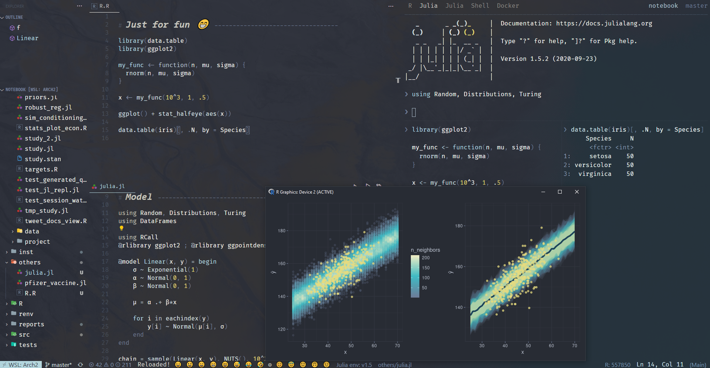

# README

_NOTE Draft only...many TODOs. Haven't updated for a super long time._

Personal theme package as part of [minimalist](https://github.com/kar9222/minimalist). See there for details.

NOTE I personally only use this for interactive use for matching the theme mentioned above. By calling `library(theme)`, the plots are automatically themed without the need to modify any codes. But it's very _hacky_. Use at your own risks.
- Automatic theming for {ggplot2}, {shiny}, {rmarkdown}, Shiny-RMarkdown, {ggdist}, {bayesplot}, {ggdag}, etc

# Install

```r
remotes::install_github('kar9222/theme')
```

# Consistent theme

See [minimalist](https://github.com/kar9222/minimalist)



# ggplot


# Shiny RMarkdown

Also works for Shiny alone, or RMarkdown alone


# {ggdist}

<details>
<summary>Code</summary>

```r
library(ggplot2) ; library(data.table) ; library(ggdist) ; library(theme)

n <- 10^3
d <- data.table(x = rnorm(n, 1, 1),
                y = rnorm(n, 2, 2),
                z = rnorm(n, 2, 1.5))
d <- melt(d, variable.name = 'id', value.name = 'val')

ggplot(d) + stat_halfeye(aes(val, id, fill = id))
```

</details>
<br>


## {ggdag}

<details>
<summary>Code</summary>

```r
library(dagitty) ; library(ggdag) ; library(theme)

dag <- dagitty("dag{
  A -> F
  F -> W
  F -> G -> W
}")
coordinates(dag) <- list(x = c(F = 0, W = 1, A = 1, G = 2),
                         y = c(F = 1, W = 0, A = 2, G = 1 ))
ggdag(dag)
```

</details>
<br>


# It works for Julia too

For details, see [Pfizer's vaccine effectiveness simulation](https://gist.github.com/kar9222/35bb254d1965dd92b87de64a15fc2734)

<details>
<summary>Code</summary>

```julia
using Random, Distributions, Turing
using RCall ; @rlibrary ggplot2 ; @rlibrary ggdist ; @rlibrary patchwork

Random.seed!(1)

# Model ------------------------------------------

# Numbers of volunteers, events in control, events in vaccine group, respectively
n, r_c, r_t = 4.4*10^4, 162, 8
n_c = n_t = n/2

@model PfizerVaccineEffectiveness(r_c, r_t) = begin
    # No prior beliefs for effectiveness
    p_c ~ Beta(1, 1)
    p_t ~ Beta(1, 1)

    r_c ~ Binomial(n_c, p_c)
    r_t ~ Binomial(n_t, p_t)

    # Generated quantities
    effect   = (p_t-p_c)*10^4  # Treatment effect
    ve       = 1 - p_t/p_c     # Vaccine effectiveness
    log_odds = log(p_t / (1-p_t)) - log(p_c / (1-p_c))

    return (effect, ve, log_odds)
end

N, n_chn, sampler_ = 10^4, 4, NUTS()

model = PfizerVaccineEffectiveness(r_c, r_t)
c = sample(model, sampler_, N)


# Plot -------------------------------------------

vals = generated_quantities(model, c)
effect, ve, log_odds = [getfield.(vals, i)[:] for i in 1:length(vals[1])]

p_effect = ggplot() + stat_halfeye(aes(effect)) +
  labs(title = "Reduction in infections on treatment per 10,000 people",
       x = "Size of effect", y = "Density")

p_log_odds = ggplot() + stat_halfeye(aes(log_odds)) +
  labs(title = """Log odds of treatment effect.
                  Negative means less likely to get infected on treatment""",
       x = "Log odds", y = "Density")

q_025, q_50, q_975 = round.(quantile(ve, [.025, .5, .975]) * 100, digits = 1)

p_ve = ggplot() + stat_halfeye(aes(ve)) +
  geom_vline(xintercept = q_50/100) +
  geom_text(aes(q_50/100, .5, label = "Median VE: $q_50%"), hjust = -.1) +
  labs(title = """Pfizer study protocol defines VE = 1 - Pt/Pc
               95% interval of effectiveness between $q_025% and $q_975%, compatible with model & data""",
       x = "Vaccine effectiveness", y = "Density")

wrap_plots(p_effect, p_log_odds, p_ve, ncol = 1)```
```

</details>
<br>


# My super messy internal notes

_NOTE Draft only...many TODOs. Haven't updated for a super long time._

## Usage

For shared theme for `theme::ggplotly` & `theme::plotly`, use `theme::plotly_shared_themes`

## Internals

- Shiny: User-specified theme is passed to `shinyr::theme_switcher` module, which internally & recursively calls
    - `theme::theme_switcher_shiny`
    - `theme::get_theme_vals_ls`
    - `theme::theme_shiny` (return CSS)
    - etc
- ggplot/plotly: ...internally & recursively call
    - `theme::get_theme_vals_ls`
    - `theme::theme_ggplot_*` (return `ggplot::theme_set`), `theme::scale_*`, `.onAttach`
    - `theme::ggplotly`
    - `theme::plotly_shared_themes`, `theme::plotly_raw & theme::plot_ly` (return `plotly::layout, plotly::config`), `theme::subplot`
    - etc
- Rmarkdown:
    - normal docs: Manually change theme in *_output.yml* & `theme::theme_*`
    - `runtime: shiny` or {bookdown}: User-specified theme is passed to attribute `data-theme` in JS of *.../www/toggle_theme.html*, which is then read by *.../www/all_themes.css*
        - Test: User similar style as Shiny for R plots, etc but for Rmarkdown, trigger JS to set attributes for custom CSS? See [extendShinyjs: Calling your own JavaScript functions from R](https://cran.r-project.org/web/packages/shinyjs/vignettes/shinyjs-extend.html)


## TODO

TODO: # TODO Workaround for 'weird/smaller' text size in WSL2. It might be due to rendering of graphics device. See commit message 'Workaround for 'weird' text size in WSL2'
- Details: Search `text = element_text(size = text_size)` of `theme_ggplot_raw`

TODO: Customize {GGally}
- [ggpairs plot with heatmap of correlation values](https://stackoverflow.com/questions/45873483/ggpairs-plot-with-heatmap-of-correlation-values)
- [Nicer scatter plots in GGgally ggpairs-ggduo](http://genoweb.toulouse.inra.fr/~pmartin/pgpmartin/2018/11/14/nicer-scatterplot-in-gggally/)

```{r}
ggpairs(mtcars, columns = c(1, 5), colour = "cyl",
    upper = list(continuous = wrap("cor", size = 9, col = 'red')))

# https://stackoverflow.com/questions/22237783/user-defined-colour-palette-in-r-and-ggpairs
ggplot <- function(...)
  ggplot2::ggplot(...) + scale_color_brewer(palette="Spectral")
unlockBinding("ggplot",parent.env(asNamespace("GGally")))
assign("ggplot",ggplot,parent.env(asNamespace("GGally")))
```

- Geoms for {ggdist}: ggplot.R, test_ggplot.R, DESCRIPTION, 01_import.R, etc

- for ggplot.R, see {thematic} ggplot.R: `options(ggplot2.discrete.colour...)`. See [Configurable qualitative color scales #3833](https://github.com/tidyverse/ggplot2/pull/3833)

- Temporarily put pkgs below as 'Suggests' field in DESCRIPTION as they are either import/recursive deps of attached pkgs e.g.
    - {viridisLite} deps on ggplot2/plotly
    - {htmltools} deps on plotly/shiny
    - {rlang} deps on purrr/ggplot2/plotly/shiny/etc. (Additionally, my funcs that call funcs of rlang are plotly & shiny)

Objects masked from {ggplot2}. See [theme::geom_line] and [theme::viridis_scales_from_ggplot2]
- geom_line
- scale_color_viridis_c
- scale_color_viridis_d
- scale_fill_viridis_c
- scale_fill_viridis_d

## ggplot obj

```{r}
pars <- ls(pattern = '^geom_', env = as.environment('package:ggplot2'))
geoms <- gsub("geom_", "", pars)

lapply(geoms, update_geom_defaults, list(...)
p$layers[[3]]$aes_params
```

## Style guide

NOTE Diff apps render colors slightly diff. For VSCode, {Colorpic} was used to match color of VSCode to that of RStudio: with same hex values, {Colorpic} showed diff values for VSCode compared to that of RStudio...manually adjust RGB values of VSCode indicated by {Colorpic} for matching. For example, with same values of RGB(200, 0, 0), {Colorpic} shows RGB(198, 0, 0) for color of VSCode...increase original values by (+2, 0, 0) to become RGB(202, 0, 0) for VSCode. However, the diff in values might not be exactly the same? Hence trial & error is needed.

Particularly, to achieve both convenience and consistency:
- 1st element doesn't have suffix (ie abc)
- 2nd element onwards have suffix (ie abc_2, abc_3)
- child elements can be automatically appended (ie abc_1_2, abc_2_1).

bg_3 - (ie bookdown and shiny top/side bar)

fg  - main
fg_2  - title
fg_3 - (ie bookdown and shiny top/side bar)
fg_4 - (ie Rmd link title)

col   - func
col_2 - string
col_3 - numeric
col_4 - keyword4

For scales:
col_2_2 - ...  |  col_2 +/- 20
col_2_3 - ...  |  col_2 +/- 40
col_4_2 - ...  |  col_4 +/- 80
col_4_3 - ...  |  col_4 +/- 75

col_5  - comment, punc
col_5_2 - line num, console arrow
col_5_3 - heading
col_5_4 - rmd figures  |
col_6 - operator  | col_5 +/- 29
col_7 - roxygen comment, plot title, legend, axis, etc  |  col_5 +/- 70
col_8 - table_strip | bg +/- 5

col_9, col_10, col_11, col_12 - line colors

col_13_* - Gold color (ie tmux's status bar for git)

hover_bg   - | bg +/- 5
hover_bg_3 - RStudio: Find in files, jobs  |  selection +/- 20
hover_fg_2 - Header hover
hover_bg_table - | bg +/- 1

shadow = |  bg +/- 27

vscode_token_color_scopes:
    punctuation:
        punctuation,
        punctuation.definition.tag,
        punctuation.definition.tag source,
        punctuation.definition.group.begin.ruby,
        punctuation.definition.group.end.ruby,
        punctuation.definition.group.begin.css,
        punctuation.definition.group.end.css,
        punctuation.definition.string.end.html source.css,
        punctuation.definition.group
    operator:
        source,
        keyword.operator,
        keyword.operator.member,
        keyword.operator.new
    keyword:
        Keyword,
        keyword.control,
        keyword.control.directive
    custom:
        # added from {R}
        keyword.operator.data.table, # `:=`, ``:=``
        keyword.operator.namespace, # `::`
        keyword.operator.custom,
        keyword.operator.fix.clashes.with.source
        keyword.operator.fix.clashes.with.source.2
        source.r                     # fix codes clash with source. NOTE it might affect others?
        constant.character.escape.r.backslash.one
        constant.character.escape.r.backslashe.two
        constant.character.escape.r.backslash.three
        constant.character.escape.r.character
        string.quoted.single.r.bracket
        string.quoted.double.r.bracket
        comment.line.roxygen.r
        # default {R}
        keyword.other.r, # roxygen keyword
        variable.parameter.r
        # default
        entity.name.function  # function object
        # default from ?
        punctuation.definition.heading.markdown
        entity.name.section.markdown
        markup.italic.markdown
        markup.bold.markdown
        markup.raw.inline.markdown
        punctuation.definition.italic.markdown
        punctuation.definition.bold.markdown
        punctuation.definition.raw.markdown
        Rmd link title
        markup.underline.link.markdown
        meta.embedded.block.r
        text.html.rmarkdown
        string.quoted.single.yaml
        string.unquoted.plain.out.yaml
        string.unquoted.block.yaml
        entity.name.tag.yaml

        #default from {VimL}
        storage.modifier.scope.viml
        vim.end.end.end
        storage.type.let.viml
        support.constant.field.viml

vscode_color_scopes:
    list:
        list.focusBackground      (#31343F  NOTE list.focusForeground not working for Ctrl + R)
    modified:
        editorGutter.addedBackground,      (#DBE0FE80 50%)
        editorGutter.deletedBackground,    (#FFA1AA80 50%)
        editorOverviewRuler.modifiedForeground,
        editorGutter.modifiedBackground
    git:
        (use either a background or a border color but not both)
        diffEditor.insertedTextBackground,  (#0099870d 5%)
        diffEditor.insertedTextBorder,      (removed)
        diffEditor.removedTextBackground,   (#C8324D0d 5%)
        diffEditor.removedTextBorder,       (removed)
